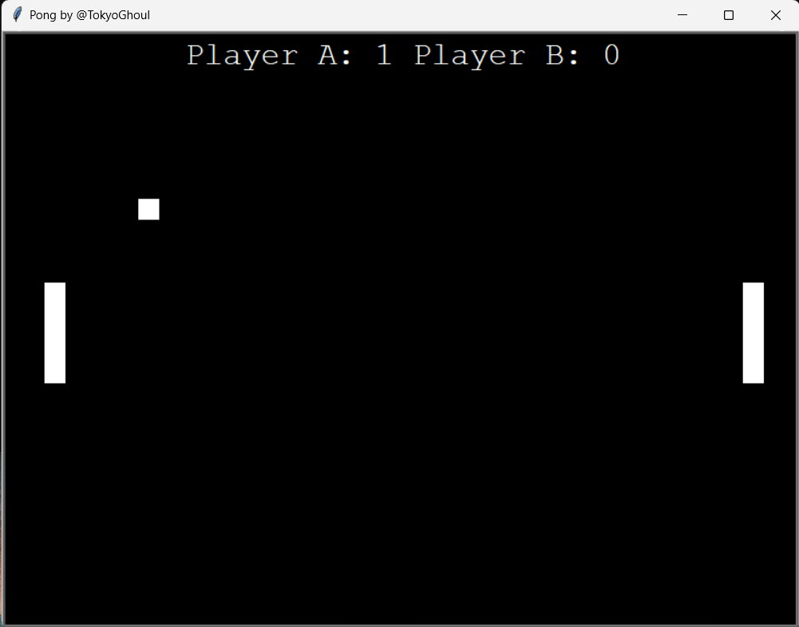

# 🏓 Pong Game

Welcome to the Pong Game, a classic arcade game implemented in Python using the Pygame library. Play against the computer and try to score points by hitting the ball past your opponent!



## 🎮 Features

- **Simple Controls:** Use the arrow keys to move your paddle.
- **Classic Gameplay:** Bounce the ball back and forth and try to score against the computer.
- **Score Tracking:** Keep track of your score and the computer's score.
- **AI Opponent:** Play against a challenging computer opponent.

## 📋 Requirements

- Python 3.12.3
- Pygame library

## ⚙️ Installation

1. **Clone the repository:**
    ```bash
    git clone https://github.com/yourusername/pong-game.git
    ```
2. **Navigate to the project directory:**
    ```bash
    cd pong-game
    ```
3. **Install the Pygame library:**
    ```bash
    pip install pygame
    ```

## ▶️ How to Play

1. **Run the game:**
    ```bash
    python main.py
    ```
2. **Controls:**
    - Use the `Up` and `Down` arrow keys to move your paddle.
3. **Objective:**
    - Bounce the ball back and forth and try to score points by getting the ball past the computer's paddle.
4. **Scoring:**
    - Each time you get the ball past the computer's paddle, you score a point.
    - The game ends when a player reaches a certain score.

## 🤝 Contributing

Contributions are welcome! If you have suggestions for improvements, feel free to:
- Fork the repository
- Create a new branch (`git checkout -b feature/AmazingFeature`)
- Commit your changes (`git commit -m 'Add some AmazingFeature'`)
- Push to the branch (`git push origin feature/AmazingFeature`)
- Open a Pull Request

For major changes, please open an issue first to discuss what you would like to change.

## 📝 License

This project is licensed under the MIT License. See the [LICENSE](LICENSE) file for details.

## 📧 Contact

If you have any questions or feedback, feel free to reach out to me via [GitHub Issues](https://github.com/yourusername/pong-game/issues).

---

Enjoy playing the Pong Game! 🎉
